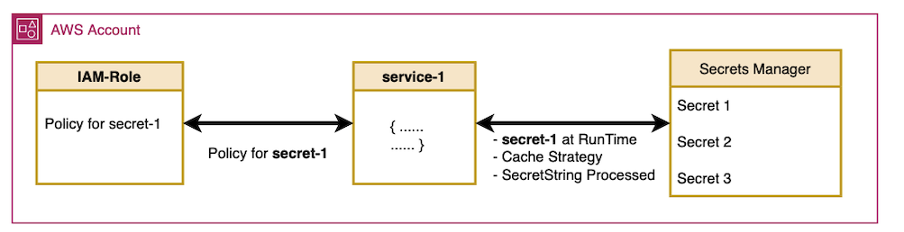
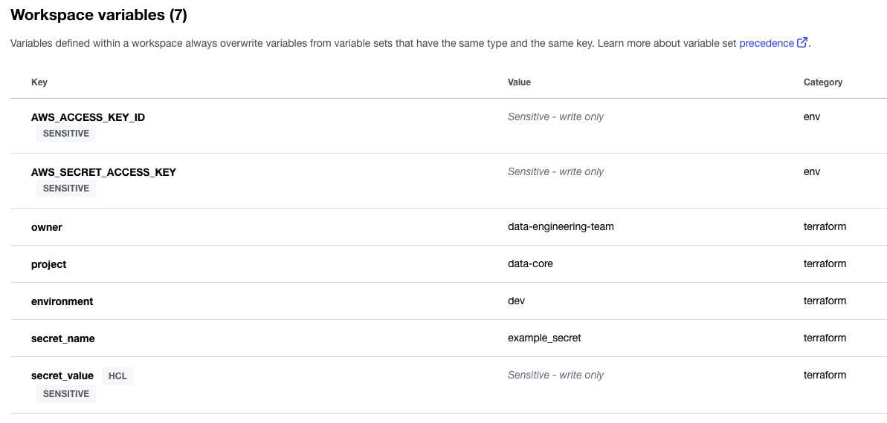
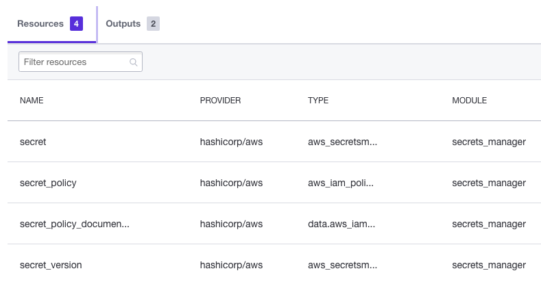
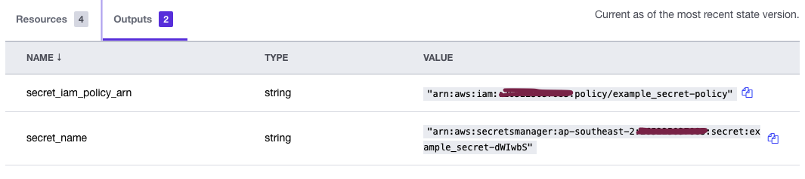

## AWS Terraform Secrets Manager Module

The purpose of this repository is to provide [AWS Secrets Manager](https://docs.aws.amazon.com/secretsmanager/latest/userguide/intro.html) as a [Terraform Module](https://www.terraform.io/language/modules/develop), in order to provision secrets from [sensitive variables](https://learn.hashicorp.com/tutorials/terraform/sensitive-variables), and to allow other AWS Resources to only access the specific secret. This module as part of the provisioning will also generate an specific [IAM Policy](https://docs.aws.amazon.com/secretsmanager/latest/userguide/auth-and-access_examples.html) to restrict the access.



In the output of the module, the `secret_name` and the `secret_iam_policy_arn` can be retrieved to configure the `Service` that will make usage of the secret, by attaching such policy ARN into its [IAM Role](https://docs.aws.amazon.com/secretsmanager/latest/userguide/auth-and-access_iam-policies.html)


### Workspace Example

Setting a Workspace in [Terraform Cloud](https://www.terraform.io/cloud-docs)

- Variables



- Created Resources



- Outputs



- IAM Policy Content

```JSON
{
    "Statement": [
        {
            "Action": [
                "secretsmanager:ListSecrets",
                "secretsmanager:ListSecretVersionIds",
                "secretsmanager:GetSecretValue",
                "secretsmanager:GetResourcePolicy",
                "secretsmanager:DescribeSecret"
            ],
            "Effect": "Allow",
            "Resource": "arn:aws:secretsmanager:ap-southeast-2:xxxxxxxxxxxx:secret:example_secret-dWIwbS",
            "Sid": ""
        }
    ],
    "Version": "2012-10-17"
}
```

**Note:** By using the `sensitive` flag in Terraform Cloud, such variable is safe in there, BUT once the plan is applied, everything will be stored in plain text in the state file, so depending where such state file is stored is quite important to take that into account, a minimum of [RBAC](https://www.terraform.io/cloud-docs/users-teams-organizations/permissions) access to state file if Terraform Cloud is used, or a restricted and encrypted S3 bucket if AWS backend is used, etc. At this current time, August 2022, there is still an open issue since 2014 about this concern, [github issue: Storing sensitive values in state files #516](https://github.com/hashicorp/terraform/issues/516)

For a more detailed usage of this approach of Secrets Manager on a ServerLess App, check the implementation in [aws-terraform-workspaces-serverless-example](https://github.com/leandro-mana/aws-terraform-workspaces-serverless-example) in the [Secret App](https://github.com/leandro-mana/aws-terraform-workspaces-serverless-example/blob/main/terraform/services/secret_app/main.tf) example.

**Contact:** [Leandro Mana](https://www.linkedin.com/in/leandro-mana-2854553b/)